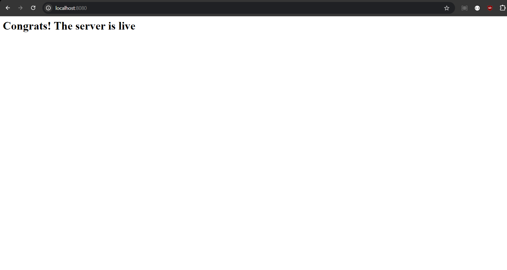

# Getting Started
To run the Backend server in the docker follow the steps:
    1. Clone the respository in to your system
    2. Make sure you have docker running
    3. Copy the command and paste it in your terminal "docker-compose up --build"
    4. Go to the localhost:8080 to check if server is running there will be page like this

